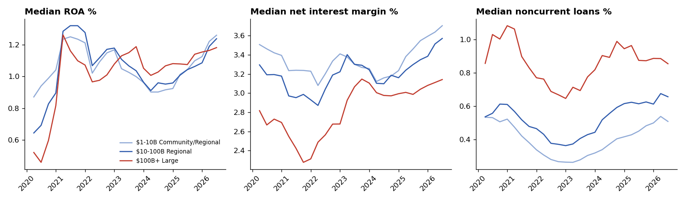
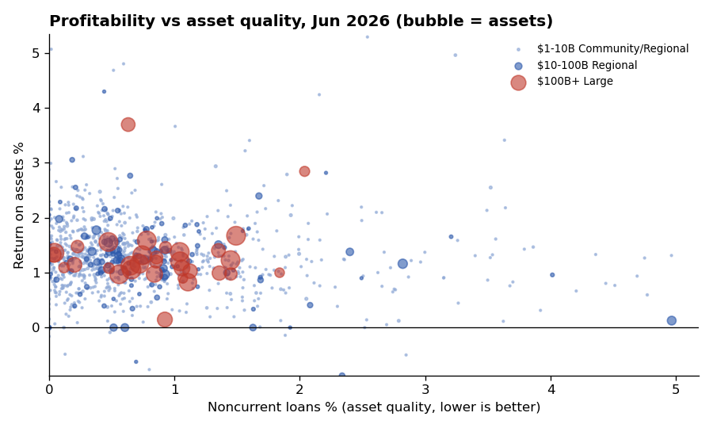

# U.S. Bank Performance Benchmarking

An automated pipeline that pulls official quarterly financial data for every U.S. bank with $1B+ in assets from the FDIC API, calculates the ratios bank analysts and regulators watch, benchmarks each bank against its size-based peers, and flags early-warning signs. It refreshes itself monthly via GitHub Actions.

**Tools:** Python (requests, pandas) · REST API · SQL (DuckDB, window functions) · Excel (openpyxl) · GitHub Actions · matplotlib · Tableau-ready output



## Business problem

Bank analysts, investors, and risk teams need to know how a bank is performing relative to comparable banks, and which banks are showing stress. Collecting Call Report data by hand every quarter is slow and error-prone.

## Results

<!-- RESULTS_START -->
| Metric | Value |
|---|---|
| Banks covered (latest quarter) | 1,067 |
| Unique banks across all quarters | 1,313 |
| Quarters covered | 26 (Mar 2020 to Jun 2026) |
| Bank-quarter records | 26,192 |
| Banks on watchlist (latest quarter) | 280 |

### Peer medians, Jun 2026
| peer_group | banks | roa | nim | noncurrent_loans | efficiency_ratio |
|---|---|---|---|---|---|
| 1: $1-10B Community/Regional | 902 | 1.26 | 3.70 | 0.51 | 59.01 |
| 2: $10-100B Regional | 133 | 1.24 | 3.57 | 0.66 | 54.95 |
| 3: $100B+ Large | 32 | 1.18 | 3.14 | 0.85 | 54.78 |
<!-- RESULTS_END -->



## Approach

1. **Extract (Python + REST API):** [fetch_fdic.py](src/fetch_fdic.py) pages through the FDIC `financials` and `institutions` endpoints with retries and rate-limit handling.
2. **Peer groups (SQL):** each bank-quarter is assigned to a size-based peer group: $1-10B, $10-100B, $100B+ ([01_bank_quarters.sql](sql/01_bank_quarters.sql)).
3. **Benchmarks (SQL):** peer medians per quarter ([02_peer_medians.sql](sql/02_peer_medians.sql)); every bank vs. its peer median with a within-peer ROA rank using `RANK() OVER (PARTITION BY ...)` ([03_bank_vs_peer.sql](sql/03_bank_vs_peer.sql)).
4. **Watchlist (SQL):** latest-quarter banks with noncurrent loans above 2x their peer median, negative ROA, or a Tier 1 leverage ratio below 5% ([04_watchlist.sql](sql/04_watchlist.sql)).
5. **Outputs:** a formatted Excel peer report (`outputs/bank_peer_report.xlsx`), a Tableau-ready dataset (`outputs/bank_benchmarks_for_tableau.csv`), and charts.
6. **Automation:** [refresh.yml](.github/workflows/refresh.yml) reruns the pipeline monthly and commits updated results.

## Metrics

| Ratio | What it tells you | Better when |
|---|---|---|
| ROA | Profit generated per dollar of assets | Higher |
| ROE | Profit generated per dollar of shareholder equity | Higher |
| Net interest margin | Spread earned between loans and deposits | Higher |
| Noncurrent loans % | Share of loans 90+ days past due or not accruing | Lower |
| Efficiency ratio | Operating cost per dollar of revenue | Lower |
| Tier 1 leverage ratio | Core capital relative to assets | Higher (5%+ = well capitalized) |

## Design decisions

- **Medians, not averages,** for peer benchmarks, so a few extreme banks don't distort the comparison.
- **Size-based peer groups,** because a $2B community bank and a $2T global bank have fundamentally different business models.
- **Closed banks kept in history** (the institutions pull has no "active only" filter), so failures like Silicon Valley Bank in 2023 stay visible in the data instead of silently disappearing.

## How to run

```bash
# macOS: use pip3 / python3
pip install -r requirements.txt
python src/run_pipeline.py              # fetches fresh data from the FDIC API (about 1-2 minutes)
python src/run_pipeline.py --use-cache  # re-analyze the last download without calling the API
```

## Optional: Tableau dashboard

Connect Tableau Public to `outputs/bank_benchmarks_for_tableau.csv`. Suggested views: a bank selector showing the chosen bank's ratios vs. its peer median, trend lines since 2020, and a ROA vs. noncurrent-loans scatter with watchlist banks highlighted. Add the public link here.

## Project structure

```text
├── .github/workflows/refresh.yml   # monthly automated refresh
├── data/README.md                  # data source details
├── sql/                            # peer groups, medians, bank-vs-peer, watchlist
├── src/fetch_fdic.py               # FDIC API extraction
├── src/run_pipeline.py             # end-to-end pipeline
├── src/excel_utils.py              # Excel report formatting
├── outputs/                        # Excel peer report + CSVs
└── images/                         # charts
```
